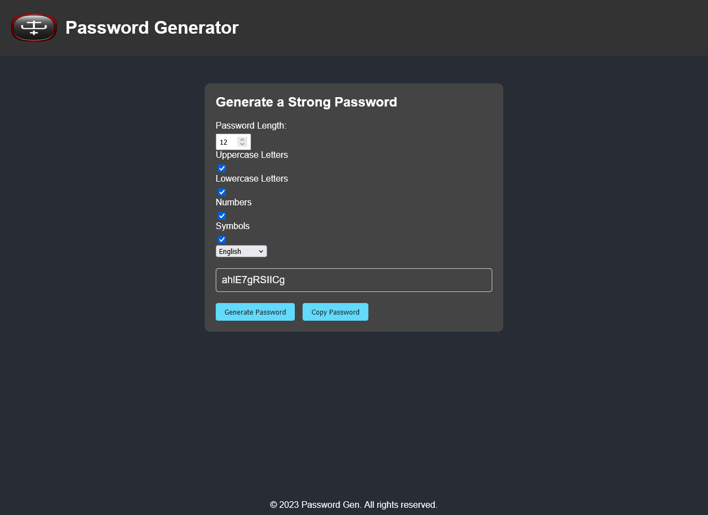

# 🔐 Advanced Password Generator  

A secure and user-friendly password generator with multi-language support, designed to create strong and customizable passwords.  

## Features  
- Generate passwords with adjustable length (1–100 characters)  
- Toggle uppercase, lowercase, numbers, and symbols  
- Copy passwords to clipboard with one click  
- Supports 9 languages: English, French, German, Hindi, Mandarin Chinese, Polish, Russian, Spanish, Ukrainian  
- Responsive design for all devices  
- Language preference saved via localStorage  

## Live Demo  
🚀 [Try it on GitHub Pages](https://ddpd.github.io/pass-gen)  
🌐 [Alternate Deployment](https://pass-gen.ddpd.dev)  

## Usage  
1. Select desired password length.  
2. Choose character types (at least one must be selected).  
3. Click "Generate Password" or adjust settings for automatic updates.  
4. Use "Copy Password" to save the result.  
5. Switch languages via the dropdown menu.  

## Installation  
Clone the repository and open `index.html` in a browser:  
```bash 
git clone https://github.com/ddpd/pass-gen.git 
cd pass-gen
```

